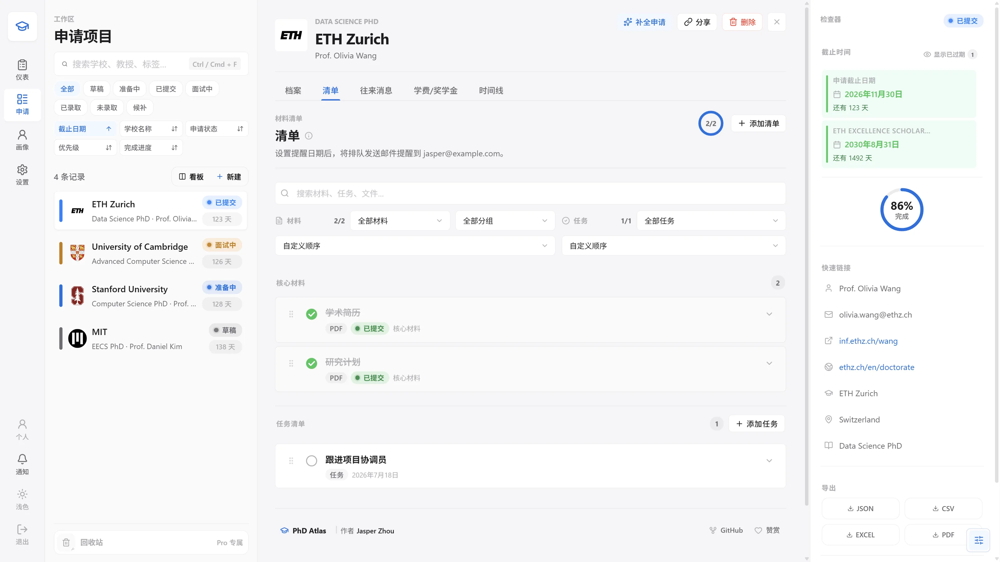
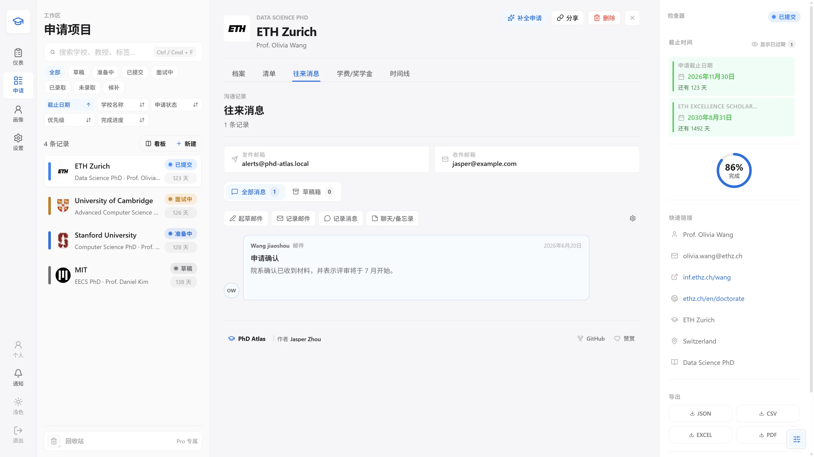
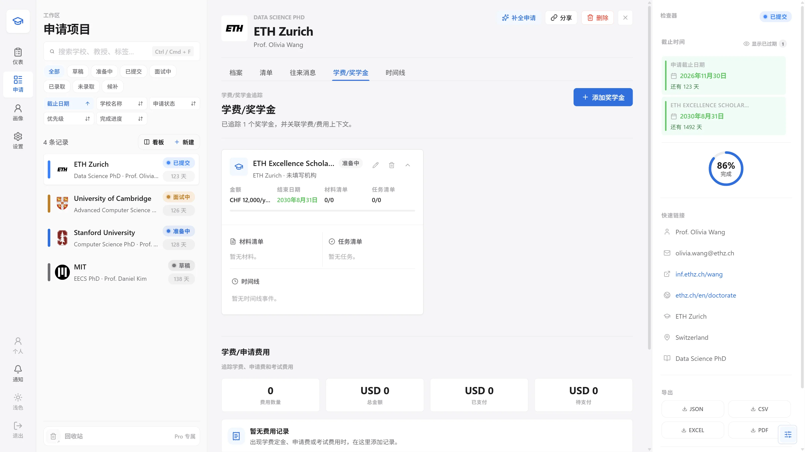
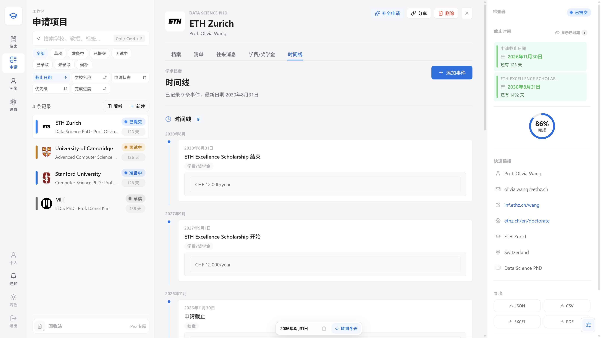
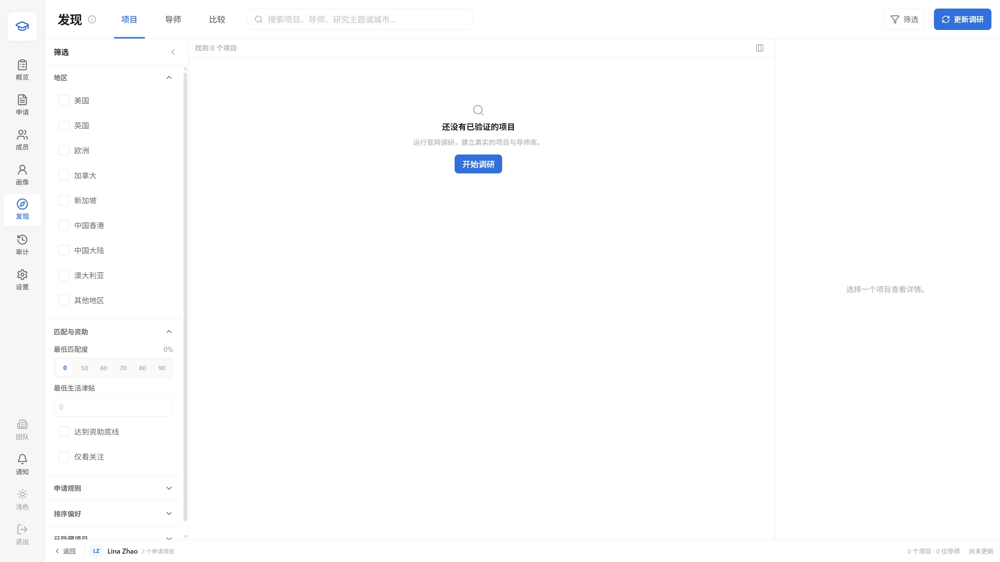
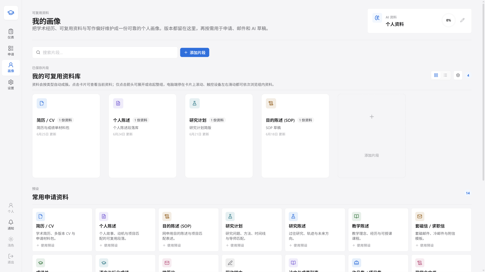

# PhD Atlas

[English](README.md) | [简体中文](README.zh-CN.md)

> 一套可自托管、隐私优先的博士申请全流程管理工作空间。

[](https://github.com/zhoujasper/phd-atlas/actions/workflows/ci.yml)
[](TODO.zh-CN.md)
[](LICENSE)
[](https://nodejs.org/)

> [!IMPORTANT]
> 本项目采用 [MIT License](LICENSE) 发布。你可以使用、复制、修改、合并、发布、
> 分发、再许可和销售本软件副本，但必须保留许可证中的版权声明和许可声明。

> [!NOTE]
> `v0.1.0` 是第一个公开稳定版。已有 Beta 安装升级前必须完整备份工作空间。
> 带版本号的安装包与校验文件以
> [Releases 页面](https://github.com/zhoujasper/phd-atlas/releases)为准。

PhD Atlas 把申请项目、潜在导师、材料、截止日期、通信、奖学金、可复用个人资料、
导出和备份集中到一个安静高效的工作空间中。它面向自托管设计：默认 SQLite，
也可选择 MySQL/MariaDB、PostgreSQL 或 Microsoft SQL Server；上传文件、备份、
凭据和集成设置都保留在你控制的基础设施上。

本仓库是**公共自托管稳定版**。当前产品只提供个人版；团队协作已在私有源码中
归档，不在此分发版本中展示、加载、测试或发布。

## 真实界面

下面所有图片均直接截取自真实运行的系统，不是手绘的营销示意图。GitHub 会根据
当前浅色/深色主题自动选图；窄屏设备会加载真正的 390 x 844 手机布局，而不是
把桌面截图缩小。

<picture>
  <source media="(prefers-color-scheme: dark) and (max-width: 700px)" srcset="public/assets/product-tour/workspace-zh-dark-mobile.webp">
  <source media="(max-width: 700px)" srcset="public/assets/product-tour/workspace-zh-light-mobile.webp">
  <source media="(prefers-color-scheme: dark)" srcset="public/assets/product-tour/workspace-zh-dark.webp">
  
</picture>

<details open>
<summary><strong>查看或收起另外五个真实系统页面</strong></summary>

### 往来消息

<picture>
  <source media="(prefers-color-scheme: dark) and (max-width: 700px)" srcset="public/assets/product-tour/correspondence-zh-dark-mobile.webp">
  <source media="(max-width: 700px)" srcset="public/assets/product-tour/correspondence-zh-light-mobile.webp">
  <source media="(prefers-color-scheme: dark)" srcset="public/assets/product-tour/correspondence-zh-dark.webp">
  
</picture>

### 学费与奖学金

<picture>
  <source media="(prefers-color-scheme: dark) and (max-width: 700px)" srcset="public/assets/product-tour/funding-zh-dark-mobile.webp">
  <source media="(max-width: 700px)" srcset="public/assets/product-tour/funding-zh-light-mobile.webp">
  <source media="(prefers-color-scheme: dark)" srcset="public/assets/product-tour/funding-zh-dark.webp">
  
</picture>

### 时间线

<picture>
  <source media="(prefers-color-scheme: dark) and (max-width: 700px)" srcset="public/assets/product-tour/timeline-zh-dark-mobile.webp">
  <source media="(max-width: 700px)" srcset="public/assets/product-tour/timeline-zh-light-mobile.webp">
  <source media="(prefers-color-scheme: dark)" srcset="public/assets/product-tour/timeline-zh-dark.webp">
  
</picture>

### 发现

<picture>
  <source media="(prefers-color-scheme: dark) and (max-width: 700px)" srcset="public/assets/product-tour/discover-zh-dark-mobile.webp">
  <source media="(max-width: 700px)" srcset="public/assets/product-tour/discover-zh-light-mobile.webp">
  <source media="(prefers-color-scheme: dark)" srcset="public/assets/product-tour/discover-zh-dark.webp">
  
</picture>

### 可复用个人画像

<picture>
  <source media="(prefers-color-scheme: dark) and (max-width: 700px)" srcset="public/assets/product-tour/profile-zh-dark-mobile.webp">
  <source media="(max-width: 700px)" srcset="public/assets/product-tour/profile-zh-light-mobile.webp">
  <source media="(prefers-color-scheme: dark)" srcset="public/assets/product-tour/profile-zh-dark.webp">
  
</picture>

</details>

## 功能总览

### 申请指挥中心

- 新建、编辑、复制、归档、恢复和永久删除申请记录。
- 跟踪大学、项目、院系、国家、申请门户、潜在导师、实验室、研究契合度、
  截止日期、状态、优先级和进度。
- 即时搜索，并按状态、国家、标签、截止日期和其他申请字段筛选。
- 在高密度列表与看板之间切换；每个申请和档案页签都有稳定的深链接。
- 通过交互式仪表盘查看状态分布、临近截止日期、最近活动、重点申请和下一步行动。
- 使用桌面式键盘操作、右键菜单和多选批量管理记录。

### 发现和比较项目

- 记录研究兴趣、目标地区、学历背景、资助需求和其他检索条件。
- 浏览并排序项目与 PI 目录。
- 调整匹配因素权重，比较生活成本调整后的奖学金，隐藏或关注候选项，并保存决策笔记。
- 把发现结果直接导入申请工作空间，同时带入学校、导师、研究、资助和时间线信息。

### 完整申请档案

- 维护中英文学校和导师资料、联系方式、主页、实验室、研究方向和契合度说明。
- 使用结构化清单管理 CV、成绩单、推荐信、个人陈述、研究计划、语言成绩、
  门户注册、SOP 和最终提交。
- 配置推荐信数量和推荐人联系信息。
- 为材料项目添加提醒、状态、分组和详细说明。
- 上传和下载文件，保留版本历史和便于回滚的元数据。
- 跟踪奖学金和资助时间窗口。
- 管理带截止日期的任务，提供平滑完成动画和统一申请事件时间线。
- 检查费用、提交就绪状态和申请级整体进度。

### 通信与邮件

- 以对话时间线记录收发邮件、聊天/消息、会议、门户活动和私人笔记。
- 撰写导师邮件，支持附件和可选 AI 草稿。
- 连接 IMAP 做严格范围的邮箱采集：只处理你申请记录中导师地址相关的邮件。
- 按文件夹游标导入收发历史并防止重复。
- 配置 SMTP 发信，并为相关事件发送站内/邮件通知。

### 个人资料库

- 集中保存可复用的 CV、成绩单、陈述、研究计划、证书和写作素材。
- 创建带本地化名称、描述、图标、颜色和内容的个人预设。
- 将个人资料插入或复制到申请中，避免反复录入。
- 创建受控上传链接来收集文件，无需分享整个工作空间。

### 分享、导出和日历

- 创建可过期、可撤销、按栏目控制权限的分享链接。
- 将申请数据导出为 JSON、CSV、Excel 和排版完善的 PDF。
- 生成日历订阅以及截止日期/任务提醒。
- 接收浏览器通知和可选 Web Push。
- 使用带已读状态和去重机制的统一通知中心。

### 备份与管理

- 创建和恢复单个申请备份及整个工作空间的系统备份。
- 管理保留策略并检查存储占用。
- 在 `/admin` 管理注册、账户、配额、会话、系统事件、邮件设置、加密策略和更新包。
- 新部署首次打开 `/admin` 时，通过一次性引导创建首位管理员，选择并验证
  SQLite、MySQL/MariaDB、PostgreSQL 或 SQL Server，再配置 SMTP；连接验证
  成功后初始化入口永久关闭。
- 后续可从 **管理后台 → 系统配置 → 数据库连接** 测试并迁移当前工作空间。
- 在 Admin 检查公开 GitHub Releases 并安装可用更新；也可展开手动备用入口，
  上传可信 Release 包。项目提供的 Docker、systemd 和 WinSW 启动器共用同一
  受保护更新助手。
- 使用请求 ID、速率限制、Zod 校验、Helmet 安全头、Host/Origin 白名单
  和隐私安全审计事件。
- 对保存的集成密钥加密；管理设置中还提供可选 SQLite 密封和加密控制。

### 可安装、响应式和无障碍

- 在兼容的 Chrome/Edge 中把 PhD Atlas 安装为 PWA。
- 离线打开缓存的工作空间快照，并将支持的个人修改排队，在恢复连接后进行冲突感知重放。
- 使用桌面、平板和手机布局：四栏桌面工作区、紧凑平板组合和移动端底部导航。
- 选择浅色/深色模式、强调色、高对比度和减少动态效果。
- 使用支持键盘的自定义日期和下拉选择控件。
- 支持英语、简体中文、德语、西班牙语、法语、意大利语、日语、韩语、
  葡萄牙语、俄语、泰语和越南语。

## 面向 Codex 与 Claude Desktop 的 MCP / Skill

PhD Atlas 提供零依赖 Codex Skill 和 Claude Desktop MCPB，可以通过自然语言在账号权限范围内操作申请、
画像、截止日期、文件、通信、发现和设置。它始终使用登录用户的真实权限；安装
Skill 不会获得管理员权限。

推荐新建 Codex 任务并告诉它：

> 使用 skill-installer，从
> `https://github.com/zhoujasper/phd-atlas/tree/main/integrations/codex/plugins/phd-atlas/skills/phd-atlas`
> 安装 PhD Atlas Skill。

需要固定、可复现版本时，把 `main` 换成对应 `v...` Release 标签。生产构建还会
提供带 checksum 的手动下载：`/downloads/phd-atlas-codex-skill.zip`、
`/downloads/phd-atlas-codex-plugin.zip` 和 `/downloads/phd-atlas-claude.mcpb`。
Skill ZIP 用于 Codex 直接安装，Plugin ZIP 额外提供本地 stdio MCP，MCPB 则用于
Claude Desktop 一键安装；三者复用同一个仅个人工作空间授权边界。手动安装前
必须验证旁边的 `.sha256`，安装或更新后新建 Codex 任务。

首次使用时，Codex 或 Claude Desktop 会在浏览器中打开 PhD Atlas 授权页；验证
网址和短验证码仍作为兜底。在该页面登录，检查
申请的 scope 和有效期，再批准或拒绝设备授权。授权可以长期使用，也可以随时
撤销，但默认和最长有效期都是 365 天，连续 180 天没有使用会提前失效，绝不是
永久授权。在 **设置 → MCP / Skill** 中可以重命名连接，查看客户端/电脑和最后使用
时间，暂停、恢复或删除连接。集成可以保存同一或不同自托管服务器上的多个账号，
列出并切换默认账号、只为一次请求指定账号，以及断开本地账号；服务端撤销始终
是权威安全边界。设置中撤销、账号禁用、`authVersion` 变化或系统全量恢复都会
立即让受影响授权失效。

专用通信工具可以设置人工邮件类别，也可以在明确确认后，用稳定幂等键执行一次
AI 分类批次；通用通信更新不能改写分类权威字段。Discover 与 AI 路由继续分别受
读取、写入和使用 scope 约束；浏览器 workspace bootstrap stream 仍明确不可用，
Interview Prep 只通过 scope version 2 capability manifest 和对应 interview
scope 开放。旧的 scope-v1 授权需要重新审批。

凭据只会在批准后创建，并保存在操作系统的用户配置目录，绝不会进入下载 ZIP、
Skill 或 Plugin 缓存。除本机回环开发外必须使用 HTTPS；不要把 Token 粘贴到
提示词。设备或凭据文件可能泄露时，应立即撤销对应授权。

## 仅个人版的产品边界

Team 协作、Team 升级、Team 入口和 Team 管理均已归档，不属于当前公开分发。
公共仓使用空白登录字段，不提供私有演示快捷方式。

## 技术栈

- React 19 + TypeScript 6 + Vite 8
- Express 5
- 通过 `better-sqlite3` 使用 SQLite，并可选择 MySQL/MariaDB、PostgreSQL
  或 Microsoft SQL Server 作为持久数据源
- Zod 数据契约
- Vitest + Testing Library + Playwright
- 基于设计变量的原生 CSS，不使用 CSS 框架

生产环境由同一个 Node.js 进程提供前端和 API。持久运维文件保存在 `storage/`；
已选数据库保存持久工作空间快照。

## 快速开始

要求：64 位 Node.js 24 LTS 和 Git。

```bash
git clone https://github.com/zhoujasper/phd-atlas.git
cd phd-atlas
npm ci
npm run dev
```

打开 `http://localhost:5173/admin`。新数据库会显示一次性设置引导，要求填写：

- 浏览器领取首次设置权限前，必须在受保护的本地环境中配置 32–512 字节
  `PHD_ATLAS_BOOTSTRAP_TOKEN`；
- 首位管理员姓名、登录邮箱和至少 12 位的密码；
- SQLite 或外部 MySQL/MariaDB、PostgreSQL、SQL Server 连接；
- 系统 SMTP 主机、端口、登录名、应用密码、TLS 选项和通知收件人。

PhD Atlas 会在保存前验证数据库和 SMTP 连接。管理员创建成功后，设置 API 永久
关闭，`/admin` 以后只显示正常登录页。公共版不附带默认密码。

首次安装、数据库权限与迁移安全、日常使用、备份和排障的逐步说明见
[INSTALLATION.zh-CN.md](INSTALLATION.zh-CN.md)。

## 生产部署

生产环境使用仓库提供的完整 Compose 服务，确保停止窗口、资源、PID、日志、
capability、持久卷、代理信任、健康检查和重启熔断边界始终一起生效：

```bash
git clone https://github.com/zhoujasper/phd-atlas.git
cd phd-atlas
cp .env.example .env
chmod 600 .env
# 在 .env 设置 DOMAIN=https://phd.example.com，然后把首次启动必需的
# 32–512 字节 token 直接写入受保护文件。
{ printf 'PHD_ATLAS_BOOTSTRAP_TOKEN='; openssl rand -base64 48 | tr -d '\n'; printf '\n'; } >> .env
docker compose pull
docker compose up -d --wait
```

不得打印、提交、记录到日志或把 bootstrap token 发到聊天中；首次 `/admin` claim
页面要求输入时，只能在可信编辑器中从 `.env` 读取。服务只绑定宿主机
`127.0.0.1:4317`，全部数据保存在命名卷中；前面必须配置 HTTPS 反向代理。

Docker、Ubuntu、通用 Linux 和 Windows Server 的完整步骤见
[DEPLOYMENT.zh-CN.md](DEPLOYMENT.zh-CN.md)。

## 配置

新生产工作空间必须设置 `DOMAIN` 与 32–512 字节
`PHD_ATLAS_BOOTSTRAP_TOKEN`。`BASE_URL`、`CORS_ORIGIN` 和 `ALLOWED_HOSTS` 从域名
自动推导，JWT 签名密钥和数据加密密钥在首次启动时自动生成并存储在持久卷中。

服务启动后，首次打开 `https://你的域名/admin`，先用受保护的 bootstrap token
领取设置权限，再创建管理员、选择数据库并配置系统发件邮箱。
可选变量包括 VAPID Web Push 密钥和 PDF 字体；完整清单见
[.env.example](.env.example)。

## 常用命令

```bash
npm run dev          # Express + Vite 开发服务器
npm run dev:web      # 仅 Vite，/api 代理到 :4317
npm run dev:api      # 仅 Express
npm run build        # TypeScript + 生产前端 + Service Worker 标记
npm run build:update-package # 构建 Admin 可接收的 .tar.gz 更新包
npm start            # 提供 API 和 dist；存在 .env 时自动加载
npm run lint         # oxlint
npm run i18n:check   # 检查语言包完整性和 UI 硬编码文本
npm test             # Vitest 单元/集成测试
npm run test:e2e     # Playwright 端到端测试
```

## 数据和备份安全

不要提交或随意删除 `storage/`，其中包含：

- `phd-atlas.sqlite` 及 WAL/SHM 文件；
- `database-connection.json`；外部数据库密码由
  `SETTINGS_ENCRYPTION_KEY` 加密；
- 上传材料和消息附件；
- 申请备份和系统备份；
- 生成的更新包和持久化集成资料。

升级前先创建系统内备份，在进程停止时复制整个 `storage/` 目录或 Docker 卷；
若使用外部数据库，同时创建匹配的数据库快照。SQLite 使用 WAL 时不能只复制主
`.sqlite` 文件。外部数据库也不能替代这个卷：上传、备份、密码字段加密的连接
信息和兼容缓存仍保存在其中；跨服务器还必须保留原
`SETTINGS_ENCRYPTION_KEY`。

## Release 与后台更新

每个 `vMAJOR.MINOR.PATCH` 或符合 SemVer 的预发布标签都会运行公共 Release 工作流。
它会验证源代码、构建生产前端、为每个受管理运行时文件生成 SHA-256 清单，
实际测试安装和回滚，再把 `.tar.gz` 与校验文件附加到 GitHub Release。
带标签的更新包和容器在发布前还必须通过隔离的 Microsoft SQL Server 2022
adapter 冒烟测试。

如果存在兼容的上一个 Release 包，工作流还会发布文件级差异包。自动更新仅在
本地持久化基线包的版本和内容指纹完全匹配时，下载新增或变化的运行时文件以及
删除清单；服务端随后重建并校验一个完整本地包，因此重启、旧镜像重放和回滚仍
沿用原有信任边界。差异包缺失、基线不符、体积没有更小或校验失败时，会自动
回退到完整包。

稳定版更新包会执行同样的运行时代码安装与回滚测试。每次更新前都应备份整个
工作空间，从 Beta 升级到首个稳定版时尤其如此。

已经运行 `v0.1.0-beta.6` 或更高版本的 Docker、Windows 原生或 Linux 原生部署：

1. 在 Admin 创建完整工作空间备份，并备份停止状态的 `storage/`。
2. 打开 **管理后台 → 系统信息 → 系统更新**，点击 **检查更新**，检查公开
   Release 后点击 **安装 vX**。
3. 服务器无法连接 GitHub 时，展开 **手动更新**；在可信设备下载 `.tar.gz`
   和 `.sha256`、验证 checksum，再上传更新包。
4. 等待服务重启，重新登录并确认版本、健康状态和一次代表性读写。

**Beta.6 一次性迁移：** Beta.5 及更早版本必须在可信设备下载 Beta.6 Release 的
`.tar.gz` 资产，再通过**手动更新**上传；本次不要依赖旧版“检查更新 → 安装”的
交接流程。成功运行 Beta.6 后，后续 Release 才使用持久化全自动更新器。Beta.6
更新包还会携带经过完整性校验的完整生产依赖图，并为未来服务端扩展保留有界的
国际/国内镜像回退。

已经发布的 `v0.1.0-beta.1` 早于这套受保护更新流程。Docker 用户必须先固定或
选择已经发布的 beta.2 镜像，再运行 `docker compose pull` 和
`docker compose up -d --wait`。原生 beta.1 部署**不能**通过旧 Admin 卡片上传
beta.2：原 systemd 沙箱既无法让助手存活，也不允许它替换运行时。应执行
[部署指南中的一次性停服引导](DEPLOYMENT.zh-CN.md#原生-beta1-到-beta2-一次性引导)，
全程只使用已校验的 beta.2 Release 包。完成引导后，才能使用 Admin 自动或手动
更新。

更新器不会替换 `.env`、已选数据库、上传文件或备份。Docker 还会把验证后的
激活 Release 包持久化到 `storage/`，因此从较旧基础镜像重建容器时可以重新
应用。信任边界、备份、首次启动和回滚细节见
[安装指南](INSTALLATION.zh-CN.md)和[部署指南](DEPLOYMENT.zh-CN.md)。

## 项目结构

```text
src/                 React 应用、类型化 API 客户端、i18n 和样式
server/              Express 路由、多数据库持久层、邮件、推送、AI 和导出
public/              PWA 清单、图标、Service Worker 和启动资源
tests/e2e/            Playwright 用户流程测试
deploy/               systemd、Nginx、WinSW 和 IIS 模板
integrations/codex/    可安装 Codex Skill 与可选 Plugin/MCP 源码
tools/                构建、验证、压力测试和启动工具
Dockerfile            可复现生产镜像
compose.yaml          单机生产 Compose 服务
INSTALLATION.zh-CN.md 首次安装、数据库选择、使用和排障
DEPLOYMENT.md         英文多平台部署指南
DEPLOYMENT.zh-CN.md   中文多平台部署指南
```

## 路线图和贡献

公共路线图见 [TODO.zh-CN.md](TODO.zh-CN.md)。欢迎提交 Issue 和聚焦明确的 PR。
提交前请运行：

```bash
npm run verify:tree
```

发布维护者还必须运行 `npm run verify:release`；它会复现更新包，并在发布标签前
实际启动 amd64 与 arm64 生产容器。

## 许可证

PhD Atlas 采用 [MIT License](LICENSE) 发布。
